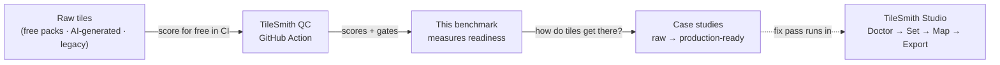
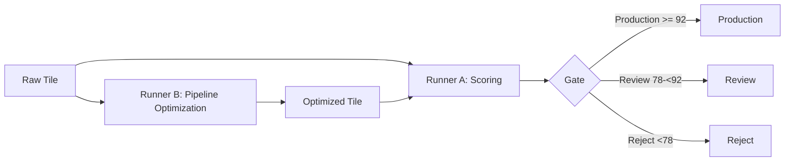

# TileSmith GC-Pipeline Benchmark

[](https://creativecommons.org/licenses/by-sa/4.0/) [](https://creativecommons.org/publicdomain/zero/1.0/) [](docs/QUALITY_SCORING.md) [](https://github.com/Kleeblatt-space/gc-pipeline-benchmark/actions/workflows/run-benchmark-ci.yml)

> **Reproducible, automated quality control for game-ready tiles — from raw assets to production-ready.** This repository contains the public benchmark framework, synthetic ground-truth data, optimization runners, and the technical telemetry specification of TileSmith.

## From raw tiles to production-ready

The benchmark answers one half of the question — *"is this tile ready?"* — with six metrics, reproducible fixtures, and fixed gates. The other half — *"how do raw assets get into that state?"* — is what the case studies in this repo document: real datasets, scored before and after a fix pass, with the method fully reproducible.



**Where things live:**

| You want to… | Use |
|---|---|
| score tiles in your pull requests, free | [TileSmith QC](https://github.com/KleeBlattSpace/tilesmith-actions) (GitHub Action, 6 lines of YAML) |
| check whether the scoring is legitimate | this repository — fixtures, ground truth, `npm run benchmark` |
| see what it takes to bring raw assets up to gate | [Case Study 01](docs/CASE_STUDY_01.md) — *Why 4.9 ★ ≠ Production-Ready* |
| run the fix pass yourself | [TileSmith Studio](https://tilesmith.kleeblatt.space) — local-first, no account needed to start |

## Problem

Visually convincing, generated textures can fail in game engines on technical details: 1-pixel borders, visible watermarks, regular pattern repetition, broken seams, or insufficient fidelity. The benchmark makes these failures measurable and establishes a comprehensible standard for technical review.

## Solution: Dual-Optimization Architecture

TileSmith separates quality measurement from active improvement. Both processes can be merged iteratively without mixing the public ground truth or proprietary tuning parameters.



**Runner A** evaluates six metrics: Seam, Border, Artifact, Pattern, Fidelity, and Textile. **Runner B** optimizes pipeline parameters and step ordering, respecting hard dependencies and degradation penalties. The public baseline is reproducible; production core models and final weights are not part of this repository.

## Repository structure and disclosure

| Directory | Purpose | Disclosure |
|---|---|---|
| `docs/` | Quality, API, privacy, telemetry, and field-study documentation | Public, licensed per document |
| `public/benchmark/` | 60 synthetic tiles, ground truth, and results | CC0 for synthetic fixtures |
| `scripts/` | Generators and validation | Public reference implementation |
| `runners/` | Scoring and pipeline-optimization skeletons | Public baseline |
| `telemetry/` | Opt-in schema, aggregate fixtures, and private storage boundaries | Schema MIT; raw data never in Git |
| `config/` | Locally generated tuning parameters | Closed, excluded via `.gitignore` |
| `tilefix-core/` | Embedded TileFixFireflyDoctor core as a Git submodule | External commit, pinned in the parent repo |

> **Two-repo strategy:** this public repository contains no secrets, CNN/ONNX weights, or final production tuning parameters. A separate private core distribution may hold proprietary scoring internals, models, and `config/tunable*.json`. The public `SCORING_INTERNALS.md` documents only the disclosure boundary and is not a store for confidential models.

## Quickstart

```bash
npm install
npm run generate
npm run ground-truth
npm run benchmark
npm run validate
```

The benchmark-v2 generator uses ten real 16×16 pixel-art topdown tiles and ten 1024×1024 HD reference images. From these it produces **120 fixtures** in six defect categories: 60 outputs under `public/benchmark/dataset/16x16/` and 60 HD outputs normalized to 64×64 under `public/benchmark/dataset/64x64/`. Sources, selection coordinates, and CC0 attribution are in [`assets/base/SOURCES.md`](assets/base/SOURCES.md); the original license file is kept as [`assets/base/KENNEY_LICENSE.txt`](assets/base/KENNEY_LICENSE.txt). `npm run assets:pixel-fetch` reproducibly extracts the pixel-art tiles, `npm run assets:hd-fetch` restores the ten HD references, and `npm run assets:verify` checks the pixel-art set. Outputs are generated and verified with `npm run generate`, `npm run ground-truth`, and `npm run validate`.

## Case studies: raw → production-ready, with numbers

The synthetic fixtures in `public/benchmark/` validate the *scorer* on prepared assets. The case studies apply the same pipeline to *real, unprepared* datasets and document the full journey — before-score, defect taxonomy, fix pass, after-score, and independent re-verification in CI:

| ID | Study | Status |
|---|---|---|
| [CS-01](docs/CASE_STUDY_01.md) | **Why the Most-Downloaded Packs ≠ Production-Ready** — auditing 10 free itch.io tilemap packs (240 tiles) | draft (illustrative data, marked) → VERIFIED after batch runs |
| — | Template & editorial rules for CS-02…N | [`docs/CASE_STUDY_TEMPLATE.md`](docs/CASE_STUDY_TEMPLATE.md) |

Each study carries a data-provenance block (sample size, selection criteria, dataset version, pipeline version, aggregation logic) and publishes aggregate data only — raw images are never mirrored in this repository. Propose a dataset for a future study via a GitHub issue; contributions must respect the license notes and the separation between public fixtures and proprietary parameters.

## TileFixFireflyDoctor core

The production core is included from [`duduspieleklee-create/TileFixFireflyDoctor`](https://github.com/duduspieleklee-create/TileFixFireflyDoctor) as a submodule under `tilefix-core/`. The parent repository stores a concrete core commit and stays reproducible; updates are deliberately reviewed and then committed as a new submodule pointer.

```bash
git clone --recurse-submodules https://github.com/Kleeblatt-space/gc-pipeline-benchmark.git
# On an existing checkout:
git submodule update --init --recursive
npm run core:check
# Reviewed update to the latest main:
git submodule update --remote --merge tilefix-core
git add .gitmodules tilefix-core
git commit -m "chore: update tilefix-core submodule"
```

`npm run core:check` verifies the checked-out commit and the expected core entry points before runners or integration checks execute. `npm run core:smoke` loads the actually exported core directly from the submodule and checks `evaluateQuality` and `calculateSeamMetrics`.

`tilefix-core` is not maintained as a public npm package and not as copied source code in this repository. The submodule serves exclusively as a reproducibly pinned test bed; the production optimization engine remains a proprietary black box provided via the TileSmith API or Studio app. The public export under `scripts/export-public.sh` does not contain the submodule.

## Telemetry and privacy

Optional telemetry is disabled by default. It is designed for numeric parameter–outcome relationships and, in the reference architecture, stores no image bytes, pixel data, file names, or direct identifiers. Hashes are not automatically anonymous; therefore purpose limitation, access protection, TTL, and deletion processes are required.

See [`docs/PRIVACY.md`](docs/PRIVACY.md), [`docs/TELEMETRY.md`](docs/TELEMETRY.md), [`docs/DATA_RETENTION.md`](docs/DATA_RETENTION.md), [`telemetry/schema.json`](telemetry/schema.json), and [`telemetry/README.md`](telemetry/README.md).

## Field study

`docs/FIELD_STUDY_01.md` and `field-study-01/report-draft.md` contain the methodology and draft for an investigation of 50 freely available asset packs. Verified real results are published only once data basis, licenses, and evaluation are documented; the current aggregate fixtures are empty and are not market statistics. [Case Study 01](docs/CASE_STUDY_01.md) is the pilot execution of this methodology (10 packs) and inherits its documentation requirements.

## Contributing and next steps

Run the quickstart, check `public/benchmark/results.json`, and report reproducible errors or scoring gaps as GitHub issues. Contributions must respect the respective license notes and the separation between public fixtures and proprietary parameters.

The benchmark fixtures are CC0; documentation and schema carry the licenses named in the files. The core engine, production models, and final tuning configurations may remain proprietary. Legal and privacy-related texts are technical working documents and should be reviewed by qualified professionals before a production service.

## License overview

| Content | License |
|---|---|
| Synthetic benchmark fixtures | CC0 unless stated otherwise in the file |
| Quality and telemetry documentation | See individual file, predominantly CC BY-SA 4.0 |
| Case-study text and aggregate data | CC BY 4.0 |
| Telemetry schema | MIT |
| Root repository and internal tooling components | See `LICENSE` and file notes |

---

<p align="center"><sub>Made with 🍀 by <a href="https://github.com/KleeBlattSpace">KleeBlattSpace</a> · <a href="https://tilesmith.kleeblatt.space">TileSmith Studio</a> · Free CI scoring: <a href="https://github.com/KleeBlattSpace/tilesmith-actions">TileSmith QC</a></sub></p>
