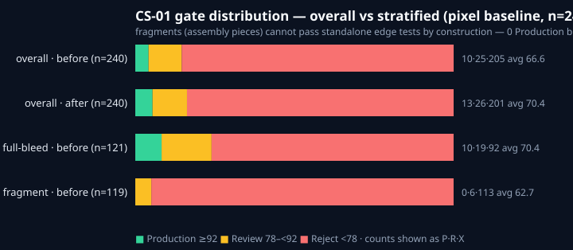
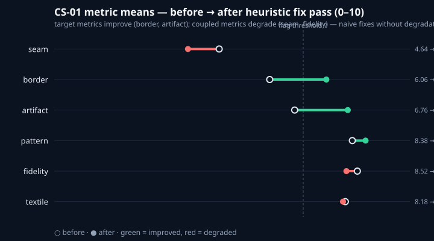
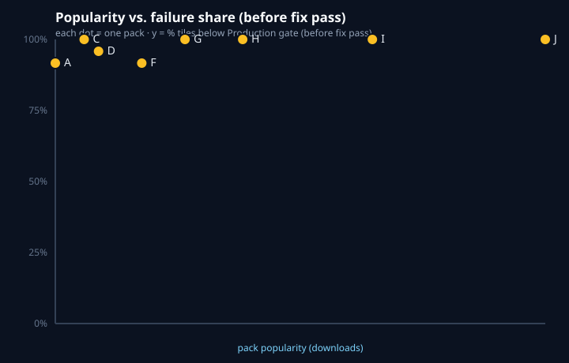

# Case Study 01 — Great Assets ≠ Ready Games

### The expectation gap, measured: 240 tiles from the most-downloaded free tilemap packs on itch.io — how big is the "asset chaos" in reality, and what does it cost on the way from graphics to gameplay? (No, the packs aren't the problem. Readiness ≠ quality — a "Reject" tile can be beautiful art that simply isn't engine-ready yet. And this time the instrument itself is on trial: half the study is about where naive QC fails *good* art.)

> **DATA STATUS: STRUCTURAL — v1.1.**
> Real packs, real inventory, real audit, real 240-tile pilot scores — but scored with the **public pixel baseline** (`pixel-baseline@1`), a transparent heuristic, *not* the pinned TileFix core. This version frames all findings against the project's north star — **time from graphics to gameplay** — and measures the hurdle in countable work units (sheets to cut, grids to find, blob rules to re-implement, tags/exports to write). A timed manual-vs-tool trial is scoped as the follow-up (§4.6); no time-saving factor is claimed before it runs.
> `STRUCTURAL → VERIFIED` flips only after a `--scorer core --require-core` rerun plus a Doctor (neighbor-aware) fix leg. See [data provenance](#9-limitations--data-provenance).
>
> **License:** CC BY 4.0 (text and aggregated data). Raw images are never mirrored in this repository; figures are abstract SVGs.

---

## 1. TL;DR

- **Framing:** we never judge creators or packs. Expert-made assets encode years of craft — downloading them doesn't download the workflow. This study measures what assets *demand from users* (and from QC tooling), not how good they are.
- **Pre-registered** ([§3.1](#31-pre-registered-hypotheses)): does popularity predict how much user-side work a pack demands? Hypotheses committed before the batch run; tested on n = 8 after two documented substitutions ([SUBSTITUTIONS.md](../case-studies/01/SUBSTITUTIONS.md)).
- We took **10 top free tilemap packs from itch.io** (**682 shipped images**, 8 exact matches to the pre-registered pool + 2 same-creator substitutions) and scored **240 sampled tiles** (24/pack, seeded, from a human-verified sheet registry) through the benchmark's six-metric gate system (Production ≥ 92, Review 78–<92, Reject < 78).
- **Gap 0 ("asset chaos") is real and huge:** 45 tile-bearing sheets hold **14,182 addressable cells**; exactly one pack ships pre-cut tiles (101 loose isometric blocks). **99.3 % of tile content arrives locked inside sheets** — cutting, naming, and autotile combinatorics land on *you*. Only 1 pack ships machine-readable metadata; only 1 ships the grid without reverse-engineering. [§4.4](#44-the-delivery-format-audit--gap-0-atomization)
- **The hurdle, counted in work units, not hours (yet):** this pilot quantifies everything a "translation machine" must do per pack — find the grid (9 of 10 need reverse-engineering), cut up to 4,096 cells per sheet, re-implement blob logic shipped as *pictures* (2 packs) or nothing (7 packs), write tags/exports from zero (9 packs). Hours come from the timed follow-up trial (§4.6) — the multiplier below is already enormous at *any* per-unit rate.
- **The scorer mostly measured itself:** the pixel baseline rejected 85.4 % — but forensics show the worst "failures" are *correct art tested the wrong way* (a seamless brick wall scoring 44; a platform edge scoring 49). Fragments (assembly pieces) went 0-for-119. The honest headline is stratified, not pooled. [§4.1–4.2](#41-gate-distribution--before-vs-after-the-fix-pass)
- **Fixing without context backfires:** the disclosed heuristic fix pass (border + despeckle only) gained +3.8 avg but **dropped 6 tiles a gate** and regressed a whole pack — a live demo of why pipeline optimization needs degradation penalties. [§4.1](#41-gate-distribution--before-vs-after-the-fix-pass)
- **Popularity vs. failure: null.** ρ = −0.62, p = 0.12 (n = 8) — not significant, and range-restricted besides (every pack fails 92–100 %). A null is also a finding. [§4.5](#45-does-popularity-predict-readiness-demand-pre-registered-h1)
- Even if you never use TileSmith: the [defect taxonomy with confound analysis](#42-the-defect-taxonomy--and-where-the-instrument-misfires), the [forensic vignettes](#5-three-tiles-three-journeys), and the [7-point checklist](#6-the-7-point-checklist-before-you-ship-a-free-pack) are usable with any tooling.

## 2. Why this study matters (even without TileSmith)

Free asset packs are the backbone of indie game development. They carry massive download counts, they ship thousands of games — and they quietly break renders: 1-pixel seams that flash when the camera scrolls, halos around trees composited on any background but the preview, watermarks from an AI generation step nobody swept up.

Download counts measure *popularity on the store page*. Engines measure *pixels at runtime* — and engines don't see pictures at all, only math and grids. In between sits the **asset chaos**: one giant image where the beginner expected finished squares, pixel-precise cutting in an image editor, spacing arithmetic, and hand-programmed edge logic (a 47-tile blob set just to blend two ground types). That hurdle frustrates hobby developers to the point of quitting — while for professionals and GPUs the big sheet is the *right* format (fewer draw calls, clearer to draw). Nothing in between measures **technical readiness for tiling** — that is the gap this study (and the benchmark behind it) addresses: a reproducible definition of "production-ready" that you can run in your own CI, for free, on every pull request, plus a measurement of the chaos itself against the project's north star: **time from graphics to gameplay**.

The expectation gap is the story: people grab assets from creators who studied for years, and expect to vibe their way to a finished game. Downloading the art doesn't download the workflow — cutting, gridding, blob-mapping, tagging — and neither the store page nor the engine says so. Readiness ≠ quality: a Reject tile can be great art that simply isn't engine-ready yet. We measure what assets *demand from users*, never how good they are.

This pilot adds an uncomfortable second gap: **naive automation fails good art.** Point a reasonable set of pixel heuristics at real autotile sheets and they reject 85 % — including tiles whose 3×3 assembly is pixel-perfect. If your pipeline gates on standalone cell scores, you will fight your own assets. The *taste* half of creator expertise must be earned; the mechanical half (cutting, naming, gating, formatting) is transferable to tooling — but only to tooling that understands *assembly*, not just cells. That division of labor is what this study makes visible, with numbers and forensics.

This study extends the benchmark's synthetic fixtures (which score *already-prepared* assets) with the question real projects face: **what state (and what *packaging*) do popular raw packs actually arrive in — and what does the journey from raw to production-ready look like, with numbers?**

## 3. Method

| Step | Detail |
|---|---|
| **Selection** | Top pool: itch.io browse — free · 2D · tilemap, popularity order. Pilot = candidates passing the license gate (explicit license statement), max 2 packs per creator. *8 of 10 downloads matched the pre-registered pool exactly; 2 substituted (same creators), logged in [`SUBSTITUTIONS.md`](../case-studies/01/SUBSTITUTIONS.md), never edited away.* |
| **Inventory** | 682 shipped images across 10 packs (counts per pack in `case-studies/01/SOURCES.md`). Extraction to gitignored `_extracted/` dirs; archives hashed (duplicate + placeholder forensics in `SUBSTITUTIONS.md`). |
| **Atomization** | Curated sheet registry (`scripts/atomize-cs01.mjs`, committed): 45 tile-bearing sheets, tile sizes from Tiled `.tsx` / filenames / author convention, **every size human-verified on grid-overlay renders** (`scripts/contact-sheet.mjs`). Characters, UI, props, backgrounds, docs, and mockups excluded from *sampling* (they're not tiles) but included in the *delivery audit* (they're shipped reality). |
| **Sample** | 240 tiles: 24 per pack, seeded shuffle (seed 20260907) over non-empty cells (transparent sheets: ≥2 % opaque; opaque sheets: luma stdev ≥ 1.0). Pack J sampled from 101 loose files (no cutting). Provenance per tile (sheet + cell coords) in `case-studies/01/data/registry.json`. |
| **Scoring** | Public pixel baseline (`pixel-baseline@1`, transparent heuristics in `scripts/case-study-batch.ts`): six metrics — Seam, Border, Artifact, Pattern, Fidelity, Textile — aggregated 0–100, gates **Production ≥ 92**, **Review 78–<92**, **Reject < 78** (single source of truth: `runners/runner-a-scoring/loss-functions.ts`). ⚠️ Standalone-cell heuristics — the study's core finding is their limits (§4.2). |
| **Fix pass** | Disclosed heuristic pass (`scripts/fix-pass-baseline.mjs`): 1px border normalization + impulse despeckle, applied **only where the matching metric flagged < 7** (clean tiles untouched: 53/240). Seam/pattern/fidelity fixes deliberately not attempted (need neighbor context = Doctor/core). |
| **Format audit** | Pre-registered heuristic (`scripts/audit-delivery-format.ts`, run as-is) **plus** curated correction from the verified registry — the heuristic's failure modes on real packs are reported, not hidden (§4.4). |
| **Work-unit model** | The hurdle is counted, not clocked (pilot has no timed trial): per pack — sheets to grid-detect, addressable cells to cut/name, blob-rule form shipped (machine / picture / none), metadata files shipped, duplicate files. Record: `case-studies/01/data/gap0-steps.json`. Hours = units × rate; the study publishes units and leaves rates to the timed follow-up (§4.6). |
| **Yardstick** | Every Gap-0 result is read against the three TileSmith steps — (1) graphical reverse-engineering (grid → pixel-perfect cuts), (2) automated logic (blob/autotile rules for beginners), (3) mass-tagging + code export (drudgery removal for pros). The audit asks, per pack: what would the machine have to do? |
| **Correlation** | Pre-registered H1–H3 (§3.1); `scripts/analyze-correlation.ts` — Spearman ρ, seeded permutation p, exploratory partial ρ controlling atlas-share. Runs on **n = 8** (B, E have no rank after substitution — enforced by the script). |
| **Verification** | Every "after" tile re-scored cold by the same baseline. Gates never re-tuned between phases. Forensic spot-checks (3×3 sheet assemblies) for the worst and best tiles. |
| **Aggregation** | Mean score per tile → gate counts per pack → pooled distribution. One tile can carry multiple defect classes (percentages sum > 100 %). Stratification rule (full-bleed vs fragment) in `scripts/stratify-cs01.mjs`. |

Pack identities use letters A–J throughout; real names, creators, licenses, and URLs are listed in [`case-studies/01/SOURCES.md`](../case-studies/01/SOURCES.md) (all 10 packs carry explicit license statements permitting analysis; the study publishes aggregates only).

### 3.1 Pre-registered hypotheses

Registered before the batch run (see git history); analysis script: `scripts/analyze-correlation.ts` (`npm run case-correlate`).

- **H1** — the more popular the pack, the higher its *user-side readiness demand* (share of tiles below the Production gate before fixing).
- **H2** — any H1 association is **mediated by delivery format** (atlas-orientation), not by craftsmanship.
- **H3** — exceptions exist: popular packs that ship beginner-ready — proving the atomization barrier is a *choice*, not a law.

Reporting rules: ρ and p always together; n = 8 is pilot-grade (10 pre-registered, 2 lost to substitution); a null result is reported as a null. Direction of interpretation: readiness demand — never creator fault.

## 4. Findings

### 4.1 Gate distribution — before vs. after the fix pass

| Gate | Threshold | Before | | After | |
|---|---|---:|---:|---:|---:|
| | | tiles | % | tiles | % |
| ✅ Production | ≥ 92 | 10 | 4.2 % | 13 | 5.4 % |
| ⚠️ Review | 78 – <92 | 25 | 10.4 % | 26 | 10.8 % |
| ❌ Reject | < 78 | 205 | 85.4 % | 201 | 83.8 % |
| **Average score** | | **66.6** | | **70.4** | |

**Do not read this table as "85 % of tiles are broken."** Read it as the instrument's confession: a standalone-cell heuristic, pointed at assembly-designed art, rejects nearly everything. The table you should actually read is the stratified one:

| Stratum | Rule | n | Avg before | P / R / X before |
|---|---|---:|---:|---|
| Full-bleed cells | every edge ≥90 % opaque | 121 | 70.4 | 10 / 19 / 92 |
| Fragments | assembly piece on empty surround | 119 | 62.7 | **0** / 6 / 113 |

Fragments — corners, edges, transitions, object parts on transparency — **cannot pass standalone edge tests by construction** (their surround *is* the transparency the test reads as halo/seam). They went 0-for-119 before and after. Even full-bleed cells over-fail: §4.2 + §5 show *why*, forensically.



**The fix pass: +3.8 average, 12 gates up, 6 gates down.** The disclosed heuristic pass (`fixlog.json`: 135 border-normalized, 115 despeckled, 53 untouched) improved exactly its target metrics (border +1.59, artifact +1.49) — and degraded coupled ones (seam −0.88 with 105 tiles worsened, fidelity −0.31). Pack G regressed as a whole (71.3 → 70.4, Review 3 → 0). The degradation rate (2.5 % of tiles dropped a gate) squeaks under the design doc's 5 % validity bar — but the lesson is the finding: **pixel touch-ups without degradation penalties and neighbor context move the average while breaking individuals.** That is precisely what Runner B's loss function (`calculatePipelineLoss`: degradation ×10, artifact ×5, constraints ×100) exists to prevent — and what neighbor-aware fixing (the Doctor's Set/Map steps) is for.



### 4.2 The defect taxonomy — and where the instrument misfires

Prevalence among the 230 tiles that did **not** pass initially (a tile can carry several defects). The right column is the point of this study: each "defect" with its **confound analysis**.

| # | Defect class | Metric | Prevalence | What it looks like in-game — and when the flag lies |
|---|---|---|---:|---|
| 1 | **Seam discontinuity** — edge pixels don't continue into the neighboring tile | Seam | 74.3 % | flashing lines when the camera scrolls — **BUT the standalone test assumes the tile neighbors *itself*.** Transition tiles (grass→dirt *inside* one cell) and offset patterns (running bond) fail while assembling perfectly (§5.1: a seamless brick wall scoring 44). Real seam signal needs intended-neighbor context. |
| 2 | **Border darkening / halo** — 1px darker or colored fringe at tile borders | Border | 58.7 % | visible grid superimposed on your map — **BUT outlined art styles put dark outlines at cell edges by design** (§5.1: mortar lines read as "darkening"), and every fragment's transparent surround reads as halo (fragments: 75 % flagged). |
| 3 | **Artifact** — watermarks, compression blocks, stray pixels | Artifact | 50.0 % | obvious stains, especially on flat snow/sand — **BUT the heuristic (‖pixel − 3×3 median‖) fires on crisp pixel-art dither and 1px highlights**, which *are* local outliers by design. No actual watermarks were found in any pack; treat this row as "texture busyness," not damage. |
| 4 | **Textile irregularity** — inconsistent internal texture frequency | Textile | 34.8 % | tiles that "feel" off next to siblings — least confounded of the six on this dataset; still assembly-blind (a corner piece *should* vary across its area). |
| 5 | **Pattern repetition** — identical feature repeats at tiling period | Pattern | 18.7 % | players see "the grid" after seconds — the most transferable metric here; 43 flags deserve real follow-up in the VERIFIED leg. |
| 6 | **Fidelity loss** — over-smoothed or detail-destroyed pixels | Fidelity | 10.9 % | mushy terrain next to crisp sprites — confounded by **intentional flat fills** (a clean grass fill has ~zero Laplacian energy, same as blur damage). 25 flags, mostly fills. |

**Three surprises worth knowing:**

1. **The worst "failure" is a perfectly good brick wall.** Pack H's `h-24` scores 44 (Reject) standalone — seam 1.5, the metric floor — while its 3×3 assembly is seamless. The running-bond offset puts different brick phases on opposite edges; the test compares a tile to *itself* instead of its *neighbors*. Assembly tiles need assembly tests. This one tile justifies the entire stratification.
2. **Fixing made 6 tiles worse.** The heuristic fix pass improved its targets and degraded coupled metrics (seam −0.88, 105 worsened), dropping 6 tiles a gate and regressing pack G wholesale. "Just normalize the borders" is not a fix strategy — it's a degradation-penalty demo. (Runner B's ×10 degradation weight exists for exactly this reason.)
3. **The only beginner-ready pack fails every test.** Pack J ships 101 pre-cut, named, engine-ingestible tiles — Gap 0 solved, H3 confirmed, the barrier *is* a choice. It scores 0/24: orthogonal seam/border metrics don't speak isometric projection (diamond neighbors, transparent corners). Right delivery, wrong ruler — projection-aware metrics are VERIFIED-leg work.

### 4.3 Per-pack view

Averages are pixel-baseline standalone scores — compare *rows* (which packs lean fill vs fragment vs outline-style), never mistake a column for a quality ranking.

| Pack | Pop. rank | Tiles | Avg before | Worst defect class | Avg after |
|---|---:|---:|---:|---|---:|
| A (16px top-down farm) | #1 | 24 | 69.5 | seam | 72.8 |
| B (16px top-down seasonal/dungeon) | — | 24 | 74.4 | seam | 77.8 |
| C (16px dungeon + anim frames) | #3 | 24 | 67.4 | seam | 72.3 |
| D (32px top-down) | #4 | 24 | 64.3 | seam | 69.8 |
| E (16px sidescroller forest) | — | 24 | 65.6 | seam | 70.9 |
| F (16px platformer caves) | #7 | 24 | 68.0 | seam | 73.9 |
| G (16px RPG forest, .tsx-verified) | #10 | 24 | 71.3 | artifact | 70.4 ⚠️ regressed |
| H (32px platformer, outlined) | #14 | 24 | 60.4 | border | 66.0 |
| I (16px industrial, sparse) | #23 | 24 | 67.4 | border | 70.7 |
| J (64px isometric, loose) | #35 | 24 | 57.5 | border | 59.6 |
| **Σ / ø** | | **240** | **66.6** | | **70.4** |

Production tiles before: 10 (B 5, A 2, D 1, F 2 — all full-bleed fills). Packs C, E, G, H, I, J: zero. The spread between packs (≈57–74) is dwarfed by the within-pack spread (44–96): **cell role (fill vs transition vs fragment) predicts the score far better than pack identity.** That is itself a finding: readiness variance lives *inside* sheets, not between store pages.

### 4.4 The delivery-format audit — Gap 0: atomization

Before quality is even measurable, most packs must be *graphically reverse-engineered*: tiles arrive fused into atlas sheets, and someone has to find the grid, cut, crop, and name the pieces before an engine — a mathematical machine that has no idea what the image depicts — can consume them. No fault on the creator side: sheets are rational pro workflow. The interesting object is the *expectation* — grabbing expert-made assets feels like it should produce expert-grade games; mechanically it can't, until the expert-side work happens somewhere.

**Two runs, honestly reported.** The pre-registered heuristic (`scripts/audit-delivery-format.ts`, gradient-energy grid detection) was run as-is — and it misfires on real packs in both directions:

| Failure mode | Example |
|---|---|
| Spurious micro-periods on noisy/scaled art | E cover art → "4×4 grid" (130,560 phantom cells); G 3×-scaled sheets → "6×6"; C autotile sheet → "4×8" |
| 3×-multiple periods on autotile sheets | H Terrain (true 32) → "96×96"; F main tileset (true 16) → "80×48" |
| Missed sparse-but-aligned grids | I industrial sheets (verified 16-grid) → "packed, 0 cells" |
| Doc/mockup false positives | usage guides, mockup covers, tree art classified as "grid atlases" |

Raw heuristic pooled output: 30 % atlas-only · 556 loose images · **242,126 "tiles in sheets"** — a phantom number we refuse to headline (kept reproducibly in `case-studies/01/data/format-audit.json`). The corrected counts below come from the human-verified registry (`scripts/atomize-cs01.mjs` + `data/registry.json`):

| Pack | Format (tiles) | Tile sheets | Addressable cells | Non-empty pool | Loose pre-cut tiles |
|---|---|---:|---:|---:|---:|
| A | atlas-only | 14 (16px) | 673 | 587 | 0 |
| B | atlas-only | 16 (16px) | 3,304 | 2,839 | 0 |
| C | atlas-only | 2 (16px) | 1,124 | 562 | 0 * |
| D | atlas-only | 3 (32px) | 384 | 173 | 0 |
| E | atlas-only | 3 (16px) | 2,004 | 1,069 | 0 |
| F | atlas-only | 1 (16px) | 4,096 | 828 | 0 |
| G | atlas-only | 2 (16/32px) | 260 | 227 | 0 |
| H | atlas-only | 2 (32px) | 289 | 113 | 0 * |
| I | atlas-only | 2 (16px) | 2,048 | 740 | 0 |
| J | **loose-only** | 0 | — | — | **101** |
| **Σ** | | **45** | **14,182** | **7,138** | **101** |

\* Packs C and H ship hundreds of loose *images* — animation frames, sprite strips, UI — but zero loose *tiles*. (The heuristic's "556 loose" counts images; only J's 101 are tiles. The distinction matters: slicing a character strip is a different job than cutting a tileset.)

**Pooled (curated): 9 of 10 packs ship tiles atlas-only · 99.3 % of tile content (14,182 of 14,283 addressable units) arrives *inside* sheets.** Every registry sheet is grid-aligned and machine-cuttable *once the grid is known* — but knowing the grid took `.tsx` metadata (G only), filename hints (H only), or human overlay verification (everything else), because naive detection fails (§4.4 table above). That detection gap is Gap 0's second half: not just *cutting*, but *finding the grid*.

**The hurdle per pack, against the three TileSmith steps** (source: `case-studies/01/data/gap0-steps.json` — all fields hand-verified):

| Pack | (1) Reverse-engineering: grid known? | Cells to cut/name | (2) Logic: blob rules shipped? | (3) Tagging/export: metadata shipped? |
|---|---|---:|---|---|
| A | ✖ human overlay (16px) | 673 | 🖼️ picture-only (bitmask reference diagrams + gif — user hand-implements) | ✖ 0 files |
| B | ✖ human overlay (16px) | 3,304 | ✖ none (blob layouts as pixels only) | ✖ 0 files |
| C | ✖ human overlay (16px) | 1,124 | ✖ none | ✖ 0 files |
| D | ✖ human overlay (32px) | 384 | ✖ none | ✖ 0 files |
| E | ✖ human overlay (16px) | 2,004 | ✖ none | ✖ 0 files |
| F | ✖ human overlay (16px) | 4,096 | ✖ none | ✖ 0 files |
| G | ✅ `.tsx` tilewidth + wangsets | 260 | ✅ picture guides **+ machine-readable wangsets** (v01–v10 `.tsx`, sample `.tmx`) | ✅ 51 files |
| H | ⚠️ filename hint (32×32) + overlay | 289 | ✖ none | ✖ 0 files |
| I | ✖ human overlay (16px; detector failed) | 2,048 | ✖ none | ✖ 0 files |
| J | ✅ n/a — pre-cut, nothing to cut | 0 (101 loose) | ✅ n/a — isometric, no blob system | ✖ 0 files (names only) |

Three readings, one per step:

1. **Reverse-engineering is needed 9 times out of 10.** Only G ships the grid in machine form and only J skips cutting entirely. The single biggest sheet (F: 4,096 cells, 828 non-empty) is a full working day of cutting and naming *before the first gameplay test* — at any plausible per-cell rate.
2. **The logic exists — as pictures.** Pack A's bitmask reference diagrams and pack G's autotile guides are exactly the "mathematical transitions" beginners must program (the 47-tile-blob family) — drawn as documentation, not shipped as rules. Only G additionally ships the rules in machine form (Tiled wangsets). For 8 of 10 packs, step 2 starts from zero: user stares at pixels, re-derives the combinatorics, implements by hand. That is the quit-frustration step, measured: 7 packs ship *nothing*, 1 ships pictures, 1 (+J n/a) ships rules.
3. **Tagging/export starts from zero almost everywhere.** 9 packs ship no machine-readable metadata at all — no tags ("solid", "water", "ramp"), no JSON, no engine-ready sidecar. Even experts who draw perfectly (and these packs *are* beautifully drawn) leave the mass-tagging and formatting to the user — the professional drudgery the project wants to automate. G's 51 `.tsx`/`.tmx` files are the lone exception, and they serve Tiled, not engines directly.

**The dedup burden (new):** pack A ships 7 byte-identical file pairs (`Basic Furniture.png` = `Basic_Furniture.png`, …) and B ships 1 — users must discover and resolve duplicates before importing. Petty individually; exactly the automatable drudgery professionals outsource.

**Why do creators ship atlases instead of ready-to-use tiles?** *(interpretation — see limitations)*

- **It is rational pro workflow.** Artists draw in sheets, batch-export once, keep file counts low — and engines want texture atlases at runtime anyway. The format is right; the *missing piece* is atomization tooling on the consumer side.
- **But it externalizes the hard part onto users.** Cutting and naming is step one; the wall is autotiling combinatorics: two ground tile types already need a 47-tile blob set to blend in every configuration; four terrain types with transitions multiply that further. Beginners see "500 tiles!" and still can't build a walkable floor. Pack J proves the alternative is possible (101 named loose files) — the barrier is a choice (H3 ✓), even if J's projection needs its own metrics.
- **The expert's counterpoint.** Hand-drawn and hand-assembled stays better at the top end — but mass-tagging and formatting hundreds of hand-drawn tiles into engine-ready data is precisely the work professional studios outsource. It is automatable drudgery on both ends.

That is Gap 0 for tooling: the pipeline's Upload step (raster/grid detection → atomize) exists so that scoring, fixing, and mapping start from *tiles*, not from a wall of fused pixels. This study's contribution to that step is a caution: **grid detection that works on synthetic sheets fails on real ones — sparse content, scaled exports, autotile multiples, and doc art all break it.** Production atomization needs the verified-registry treatment (or the Studio Upload raster detection), not raw gradient autocorrelation.

### 4.5 Does popularity predict readiness demand? *(pre-registered H1)*

**n = 8 packs · Spearman ρ = −0.62 · permutation p = 0.12 · partial ρ (controlling atlas-share, exploratory) = −0.42**

Verdict: **not consistent with H1 at α = 0.05 — popularity does not predict failure here; report honestly (a null is also a finding).** Fail-shares: A 91.7 % · C 100 % · D 95.8 % · F 91.7 % · G 100 % · H 100 % · I 100 % · J 100 %.



*(Scatter x-axis: popularity rank — further right = less popular. Packs B and E excluded: no rank after substitution.)*

Two caveats make this null *uninformative* rather than decisive, and both are disclosed, not buried: **(1) range restriction** — with every pack failing 92–100 % on standalone baseline scores, there is almost no variance left for popularity to explain; H1 becomes testable only with an assembly-aware scorer that spreads packs out. **(2) The atlas-share control is weak** — it inherits the heuristic audit's phantom counts, which saturate most shares near 1.0. Exception candidates by residual (H3): C, G, H — all at 100 % fail-share, i.e. the "exceptions" are an artifact of tied ranks, not real deviations. H3's actual evidence is qualitative and stronger: **pack J ships beginner-ready (101 loose tiles)** — the barrier is a choice, proven by existence.

### 4.6 From hurdle to hours: the time question (honestly scoped)

The project's north star is **time from graphics to gameplay** — and the study goal asks for proof that the tool shortens it drastically. Status after this pilot: **the hurdle is quantified in work units, not hours.** Deliberately: clocking time requires a controlled trial, and inventing per-unit rates ("a cell takes N minutes") would fabricate the headline the study exists to earn.

What the units already say: 14,182 addressable cells to cut/name/inspect across 45 sheets, 9 grids to reverse-engineer, blob logic to re-derive from pictures-or-nothing for 8 packs, tags/exports to write from zero for 9 packs — plus dedup detective work (A: 7 pairs) and quality-checking that itself needs assembly context (§4.2). At *any* per-unit rate above seconds, that is hours-to-days per pack before gameplay — which matches the qualitative complaint (beginners quitting in Photoshop) without pretending to measure it.

**Pre-registered follow-up: the timed trial (CS-02 candidate).** Protocol sketch, committed here before running: take 3 sheets spanning the difficulty range (dense grid J-style loose set as control; mid-size F mainlev; sparse I industrial), define "gameplay-ready" as *cut + named + grid-verified + blob-mapped + tagged + engine-importable + QC-gated*, and time two paths — (a) manual (image editor + hand-written rules, N≥3 practitioners, screen-recorded) vs (b) TileSmith Studio (Upload → Doctor → Set → Map → Export). Report median hours per path with ranges, never a single "×N faster" without the distribution. *That* trial earns the time-saving factor; this pilot earns the work-unit denominator it will divide.

## 5. Three tiles, three journeys

Concrete vignettes — the study's core. All scores real (pixel baseline); provenance (sheet + cell) in `data/registry.json`; forensic renders were produced locally and verified by eye (not committed — aggregates only). Read against the three steps: 5.1 shows the *checker* failing for lack of assembly logic (step 2's input); 5.2 shows a transition tile no cell-grader can judge (step 2's raison d'être); 5.3 shows what passes today — and what "leaving clean tiles alone" looks like.

### 5.1 `h-24` — the seamless wall that scored 44 (Pack H, 32×32)

- **Before: 44 (Reject)** — Seam 1.5/10 (the metric floor), Border 2.4, Artifact 5.9. A pink running-bond brick fill from `Terrain (32x32).png`, cell (10,8).
- **Forensics:** the 3×3 sheet assembly around the cell is *seamless* — brick courses continue across every boundary. The flag is pure context artifact: running bond puts different brick phases on the tile's left vs right edge, and the standalone test compares the tile to *itself*. The dark mortar lines touching cell edges add a border confound (outlined style, not damage).
- **Fix:** border normalization + despeckle applied (both metrics had flagged). Score moved 44 → ~50s: polishing the pixels of a tile whose "defect" is the test's missing neighbor context. The honest fix is a neighbor-aware seam test, not pixel surgery.
- **Lesson:** this tile alone invalidates pooled Reject percentages as readiness claims — and validates the stratification. In your own QC: **never gate assembly tiles on standalone seam scores.**

### 5.2 `d-10` — the platform edge that scored 49 (Pack D, 32×32)

- **Before: 49 (Reject)** — Seam 1.5, Border 2.1, Artifact 10.0. A stone-platform edge from `TX Tileset Stone Ground.png`, cell (6,2): flat stone fill with a shadowed edge along two sides.
- **Forensics:** a *transition* tile — its left/top edges (flat fill) are supposed to differ from its bottom/right edges (platform lip). The standalone seam test reads intentional asymmetry as discontinuity. Note the sheet-adjacency trap, too: neighboring cells *in the sheet* are other piece types, not map neighbors — even a 3×3 sheet window can't judge this tile. Only intended-neighbor (autotile-rule/map) context can.
- **Fix:** border normalization fired; the shadow lip is intentional shading, so "fixing" the border means *damaging the art direction*. The pass improved the number while arguably worsening the tile — the degradation lesson in miniature.
- **Lesson:** transition pieces are the majority of real tileset cells (see the pools in §4.4: most sheets are edge/corner/transition sets). Any QC that can't tell "transition" from "broken" will red-flag most of a good pack.

### 5.3 `b-11` — the snow fill that passed (Pack B, 16×16)

- **Before: 96 (Production)** — Seam/Border/Artifact all 10.0. A pale snow fill with soft drifts from `snow tiles 2.png`, cell (5,22).
- **Why it passes:** full-bleed, self-similar, no outlines at edges, no dither spikes — exactly the texture family the heuristics were calibrated on. Its 3×3 assembly is clean, and so is the standalone score. Agreement between test and reality, for once.
- **Fix:** none — no metric flagged, so the pass touched nothing (53/240 tiles skipped). Degradation discipline working as designed: the one thing the heuristic leg gets right is *leaving clean tiles alone*.
- **Lesson:** the baseline is a decent **fill-tile** grader and a poor **assembly-tile** grader. All 10 pre-fix Production tiles are fills. If your pack is mostly fills (open fields, snow, sand), standalone gating works today; if it's transitions and outlines (dungeons, platformers, outlined styles), you need assembly-aware QC — the VERIFIED leg.

## 6. The 7-point checklist before you ship a free pack

Usable with any tooling — this section works without TileSmith. Updated with this study's evidence (assembly context is now points 0–1, not an afterthought):

0. **Atomize before anything:** if the pack ships as atlas sheets, establish the grid (ship a `.tsx`/grid note like pack G — it was the only pack where the grid needed zero reverse-engineering) and cut before judging anything. Bonus if you ship the *rules* too: pack G's wangsets and pack A's bitmask diagrams are the most-valuable files in their packs for beginners — machine-readable beats picture, picture beats nothing. The quality of an uncut sheet is unmeasurable, and so is your gameplay.
1. **Edge-continuity test with REAL neighbors:** place the tile with its *intended* neighbors (autotile rules, not sheet adjacency, not self-tiling). Seams show only *in company* — and self-tiling tests false-flag transitions and offset patterns (§5.1).
2. **1-pixel border audit, style-aware:** zoom to 800 %, walk all four edges — but first decide whether edge darkening is damage or your outline style. Outlined packs will trip every naive border gate (§5.1).
3. **Composite-background test:** preview transparent tiles over one light, one dark, one saturated background — not over the store's blue. (Fragments live or die by their surround.)
4. **2×2 repetition test:** tile the tile 2×2 (and 4×4). If you can spot the period in 3 seconds, players will in 3 seconds. (Pattern was the least-confounded metric in this study — trust it most.)
5. **Deduplicate your file list:** 7 of pack A's files are byte-identical pairs under different names. A hash pass before export saves every downloader the same detective work.
6. **Sibling consistency:** animation frames and terrain variants next to each other, same zoom — texture frequency should match. (Pack C's 190 frame files vs 2 tileset sheets show how frame-heavy "tilemap" packs get — audit frames as *sets*, because a fixed frame next to broken siblings just moves the flicker.)
7. **Gate it in CI:** scores age like milk; a PR check keeps packs honest after every edit — but gate *fills* on standalone scores and *assembly pieces* on assembly tests, or you'll red-flag your own correct art. (The 6-line YAML below does the scoring part.)

## 7. Reproduce this study & score your own assets

**Full benchmark, locally** (120 CC0 fixtures, six metrics, reproducible gates):

```bash
git clone --recurse-submodules https://github.com/KleeBlattSpace/gc-pipeline-benchmark.git
cd gc-pipeline-benchmark
npm install
npm run generate        # synthetic fixtures from CC0 base assets
npm run ground-truth    # expected scores + gates
npm run benchmark       # Runner A scoring + Runner B optimization
npm run validate        # verify against ground truth
```

**This case study, end to end** (requires the 10 pack archives in `case-studies/01/raw/`, per `SUBSTITUTIONS.md` — archives are gitignored working material, never committed):

```bash
npm install
# 1. extract + inventory (paths in case-studies/01/SUBSTITUTIONS.md)
node scripts/inventory-pack-images.mjs            # 682 shipped images, dims
# 2. Gap-0 audit, pre-registered heuristic, run as-is
npx tsx scripts/audit-delivery-format.ts          # → data/format-audit.{json,md}
# 3. curated atomization + seeded sampling (registry + rules in-file)
node scripts/atomize-cs01.mjs                     # → raw/<ID>/_tiles/ + data/registry.json
# 4. score before/after (public baseline; --scorer core --require-core for VERIFIED)
node scripts/fix-pass-baseline.mjs                # → raw/<ID>/_fixed/ + data/fixlog.json
npx tsx scripts/case-study-batch.ts --manifest case-studies/01/data/manifest-scoring.json --out case-studies/01/data --scorer pixel
# 5. stratify + correlate + figures
node scripts/stratify-cs01.mjs                    # → data/stratification.json
npx tsx scripts/analyze-correlation.ts --manifest case-studies/01/manifest-correlation.json --format-audit case-studies/01/data/format-audit.json
node scripts/make-cs01-figures.mjs                # → data/figures/*.svg
```

**Score your pack continuously, free, in CI** — [TileSmith QC](https://github.com/KleeBlattSpace/tilesmith-actions) on every pull request:

```yaml
- uses: KleeBlattSpace/tilesmith-actions@v1
  with:
    api-key: ${{ secrets.TILESMITH_API_KEY }}
    paths: 'assets/**'
```

You get a per-tile PR table, one overlay PNG per tile (frame color = verdict), `report.json`, and workflow outputs. Free under fair use; images are never stored. (After this study: interpret standalone flags on assembly pieces with §4.2's confound table in hand.)

## 8. From measuring to fixing — the honest bridge

Everything above works **without giving TileSmith anything** — the benchmark is public, the QC action is free, the checklist is tool-agnostic, and this study's harshest findings are about *our own* public baseline.

But notice the shape of the problem this pilot mapped — it falls into exactly three steps, and each one is currently manual: **(1) reverse-engineering** — finding the grid defeats naive detection on most real sheets, and cutting/naming up to 4,096 cells per sheet is pure drudgery; **(2) logic** — blob/autotile rules arrive as pictures or not at all, so beginners re-derive combinatorics by hand (the quit-frustration step) while even our own checker fails without neighbor context ("Reject 44" on a seamless wall); **(3) tagging and export** — 9 of 10 packs ship zero machine-readable metadata, so mass-tagging ("solid", "water", "ramp") and engine-ready sidecars are written from scratch. A translation machine between graphics and code would take all three — pixel-perfect cutting, grid detection plus blob computation, automatic tags plus JSON the engine understands directly. In the TileSmith pipeline that machine is the **TileFix Doctor** (Upload → Doctor → Set → Map → Export), and it runs locally in your browser — no account needed to start. Pricing, answered up front (because someone will ask): the basic Studio products — TileDoctor, TileSetCreator, Terrain Studio, TileMap Creator — are free of charge within a starter asset volume meant to give upcoming creators enough to begin, and the GitHub workflow actions plus the web demo are free too. (The raw-image-to-engine-ready pipeline itself runs TileDoctor → TileSetCreator → Terrain Studio (partially); TileMap Creator builds on ready tiles downstream.) KleeBlatt Space isn't trading one paywall (paid assets) for another (paid tooling) — the gates in this study stay runnable in your own CI, free. When your CI says Review or Reject, the Doctor is the piece that answers the question this study deliberately leaves open: *broken, or just unassembled, unlabeled, and unexported?*

The loop closes where it started: fixed tiles re-scored by the free action in your own PRs — and this study's VERIFIED leg, re-run with the pinned core plus a Doctor fix leg, will show whether assembly-aware tooling clears the bar the baseline couldn't. You never have to take our word for anything.

## 9. Limitations & data provenance

**Provenance (mandated format per `docs/FIELD_STUDY_01.md`):**

| Field | Value |
|---|---|
| Data status | **STRUCTURAL (v1.0)** — real packs/inventory/audit/pilot scores; scorer is the public pixel baseline, not publication-grade |
| Sample size | 240 tiles (24/pack × 10), pooled from 7,138 non-empty registry cells + 101 loose files; 682 shipped images inventoried |
| Selection criteria | itch.io free · 2D · tilemap, popularity order; license gate; max 2 packs/creator; 8 exact + 2 same-creator substitutions (logged, [`SUBSTITUTIONS.md`](../case-studies/01/SUBSTITUTIONS.md)) |
| Dataset version | benchmark-v2 fixture set (120 CC0 fixtures, 16×16 + 64×64 classes) for the scorer; CS-01 registry v1 (45 sheets, 14,182 addressable cells) for the sample |
| Pipeline version | `pixel-baseline@1` (public heuristic, in-repo) + `fix-pass-baseline` (border/despeckle only); `tilefix-core` submodule NOT resolved at run time — VERIFIED requires `--scorer core --require-core` |
| Aggregation logic | mean per-tile score → gate counts; multi-defect counting (metric < 7/10); stratification (full-bleed vs fragment) by edge-opacity rule |
| Raw images | never mirrored in this repository (hashes + sheet/cell provenance only, in `data/*.json`) |
| Data files | `case-studies/01/data/`: `batch-results.json` (480 scored tiles: 240 before + 240 after) · `tables.md` · `registry.json` · `gap0-steps.json` (per-pack Studio-step readiness) · `fixlog.json` · `stratification.json` · `format-audit.json` · `correlation.json` + scatter SVG · `figures/` (abstract SVGs) · `manifest-scoring.json` · `manifest-correlation.json` (at `case-studies/01/`) |

**Limitations:** no time is clocked in this pilot — work units (§4.4–4.6) are the quantified hurdle, and any per-unit rate or "×N faster" factor awaits the pre-registered timed trial; framing: readiness ≠ art quality — readiness gates measure engine-readiness, never artistic value — a Reject tile can be great art; the pixel baseline is a standalone-cell heuristic calibrated on synthetic textures — on assembly-designed art its seam/border/artifact flags are dominated by the confounds in §4.2 (assembly-context absence, outline styles, dither), so gate percentages must not be quoted as pack readiness verdicts; the heuristic grid detector both hallucinates grids (docs, scaled art) and misses real ones (sparse sheets) — curated registry counts supersede it; pack J (isometric) needs projection-aware metrics the baseline lacks; the H1 null is range-restricted and uninformative (n = 8, fail-share 92–100 %); the fix leg is two pixel ops, not the Doctor — its small net delta (+3.8) with 6 gate drops demonstrates metric coupling, not production fixing; B/E substitutions cost two correlation ranks (logged, never imputed); "why creators ship atlases" (§4.4) is interpretation, not survey data; n = 10 packs is a pilot — Field Study 01's 50-pack sweep is the follow-up, and the VERIFIED rerun (pinned core + Doctor leg) is the required next pass on this same sample. Beyond CS-01's scope lie two further obstacles named by the project's goal: the effort of *creating* assets in the first place, and — downstream of ready tiles — authoring layered world maps at scale (hundreds of tiles plus atlas, metadata, and folders, mapped by hand into engine layers; generative image tools today don't emit engine-layered maps at all). Both are future-study territory; CS-01 measures the middle segment only: raw tiles to ready tiles.

## 10. Credits & license

- Text and aggregated data: **CC BY 4.0**.
- Benchmark fixtures: **CC0**, base assets from [Kenney](https://kenney.nl) (`assets/base/KENNEY_LICENSE.txt`).
- Pack sources: credited individually in [`case-studies/01/SOURCES.md`](../case-studies/01/SOURCES.md) (all 10 packs fetched 2026-09-07; per-pack licenses recorded from bundled readmes + store pages). Special thanks to the creators — Cup Nooble, Pixel_Poem, Cainos, Anokolisa, Szadi art., Seliel the Shaper, Pixel Frog, 0x72, Devil's Workshop — whose free packs carry this study; nothing here rates their art, only what raw downloads demand from users and tooling.
- Scoring & optimization: [TileSmith GC-Pipeline Benchmark](../README.md) · CI scoring: [TileSmith QC](https://github.com/KleeBlattSpace/tilesmith-actions) · fix pipeline: [TileSmith Studio](https://tilesmith.kleeblatt.space), made with 🍀 by [KleeBlattSpace](https://github.com/KleeBlattSpace).
